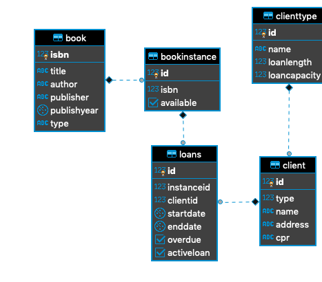

# Library

## How to start and get going:
    So you have to load the script init.sql and run it. It runs the setup creates all functions,
    stored procedures, triggers etc. and uses insert_loan and return_loan procedures to test some functionality.

## Creating appropriate data model  

ER Diagram:  
  

## Creating and populating the database with sufficient test data  
    We created a little bit of test data but it is sufficent to test all the functionality  
    Run the insert.sql script 
## Programming the requested functionality in SQL    

#### Bookavailability:  
    You can see the requested functions and functionality in requestedfunctions.sql 
    or view the body part of the code in the pictures below  

  

#### Popularbook among highschool student:  
  

#### Notice when returning book too late:  

  

#### 

### Add constrains reflecting the business rules

    We have made trigger to make sure all functionality happens when a simple call is made.

    We also added contraint in the createtable to make sure data is valid.

### Add constrains ensuring referential integrity
    We made foreign keys to reference to the correct objects and not using any other references.
### Keeping transactions ACID and protected against blocking and deadlocks
    We are using stored procedures to insert and update loans. Here we use transactions
    to make sure our data is updated in all tables or call never is written if error occurs.
### Considering optimization of the queries
    Alot of our queries have many inner joins which is very performance heavy and slow. 
    But considering the setup it is hard to change it.
###  Protecting the use of the database with user account management, and control of privileges.
    We have made different privileges for different user of the system.   
    Users can loan and therefore they can insert and update their loan but not delete
    it or do anything in the book table at all.

    We also have a user for the librarian who can do anything regarding the books.